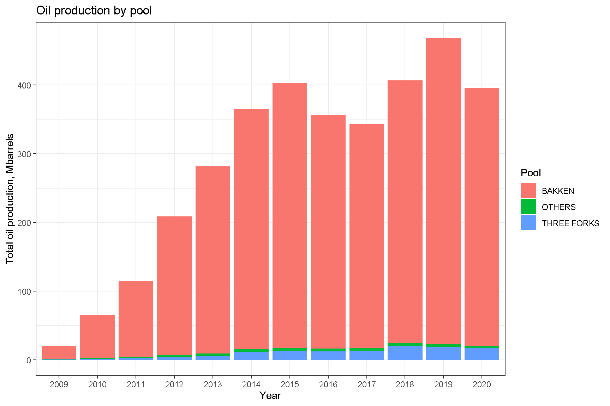
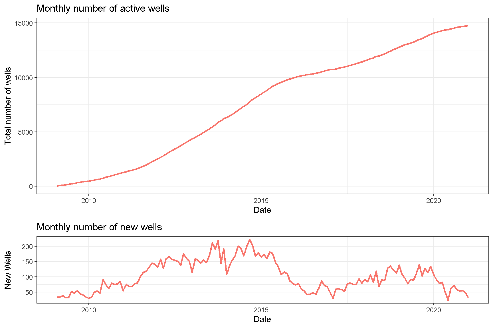
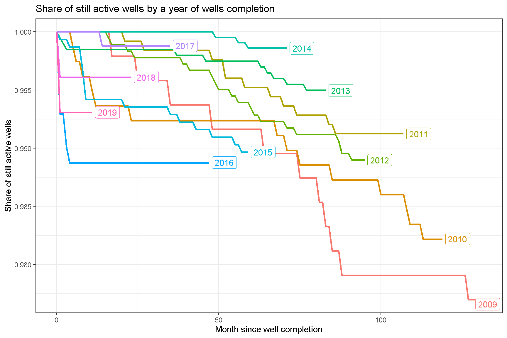
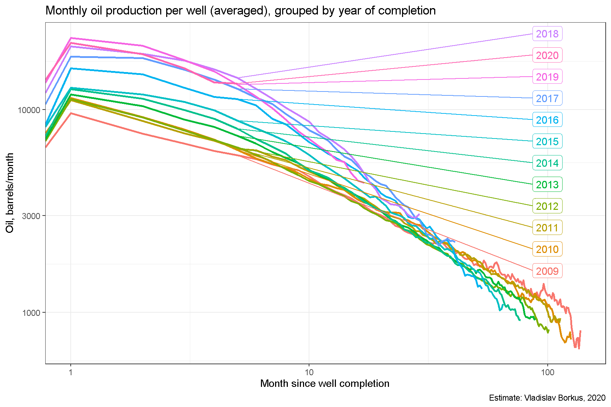
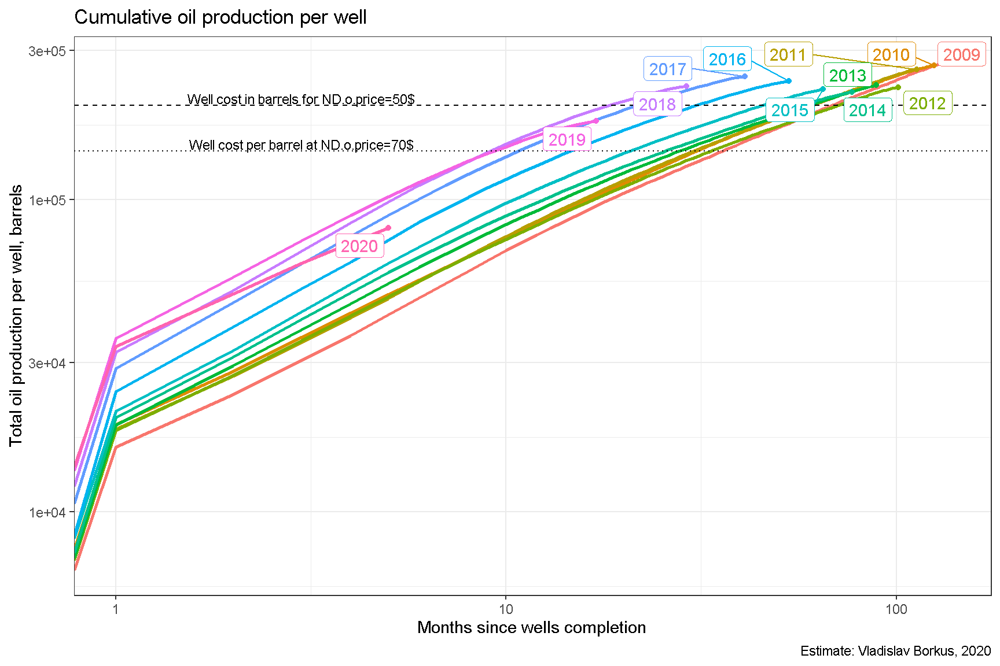
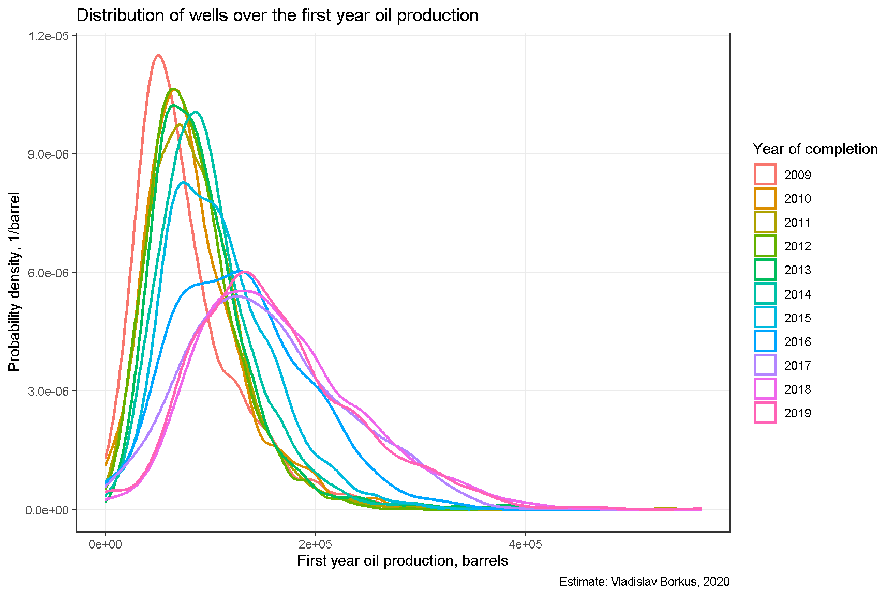
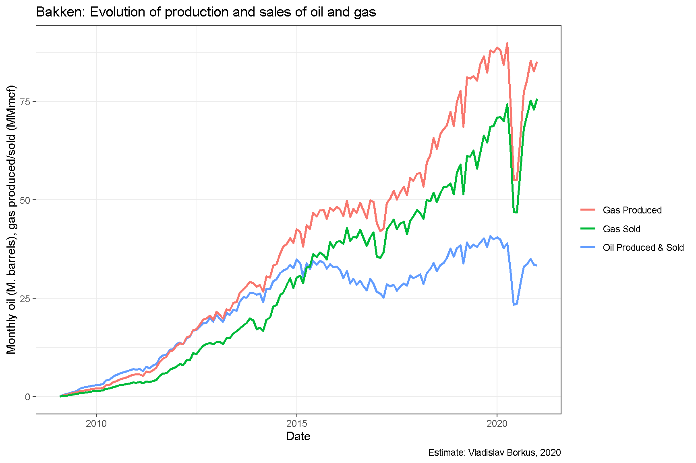
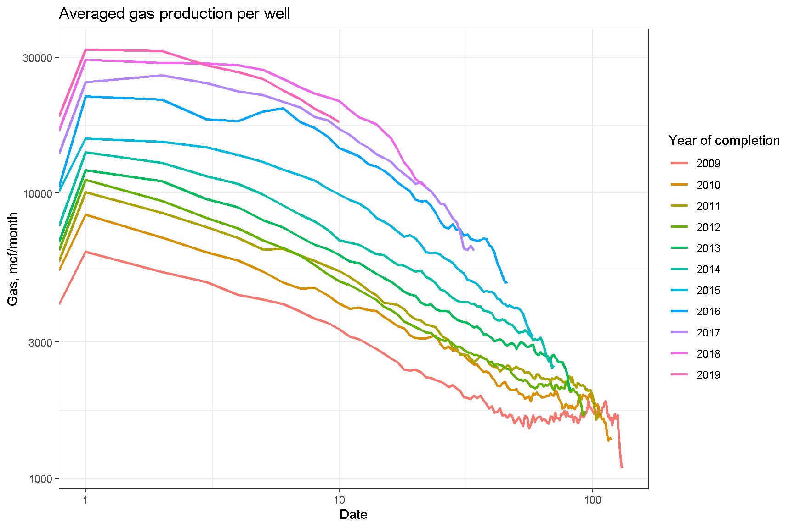
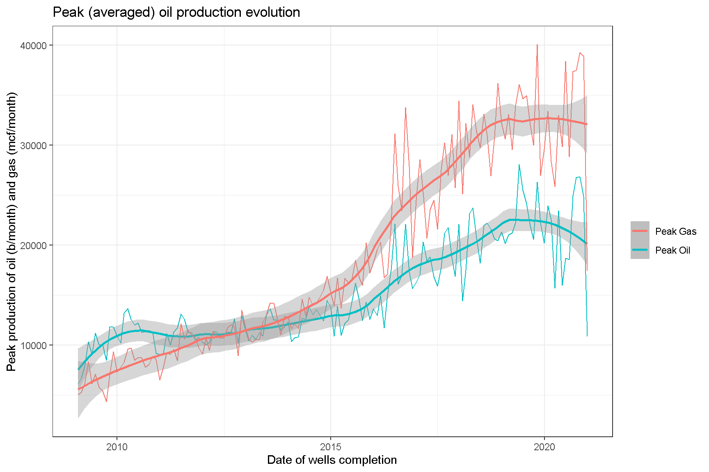
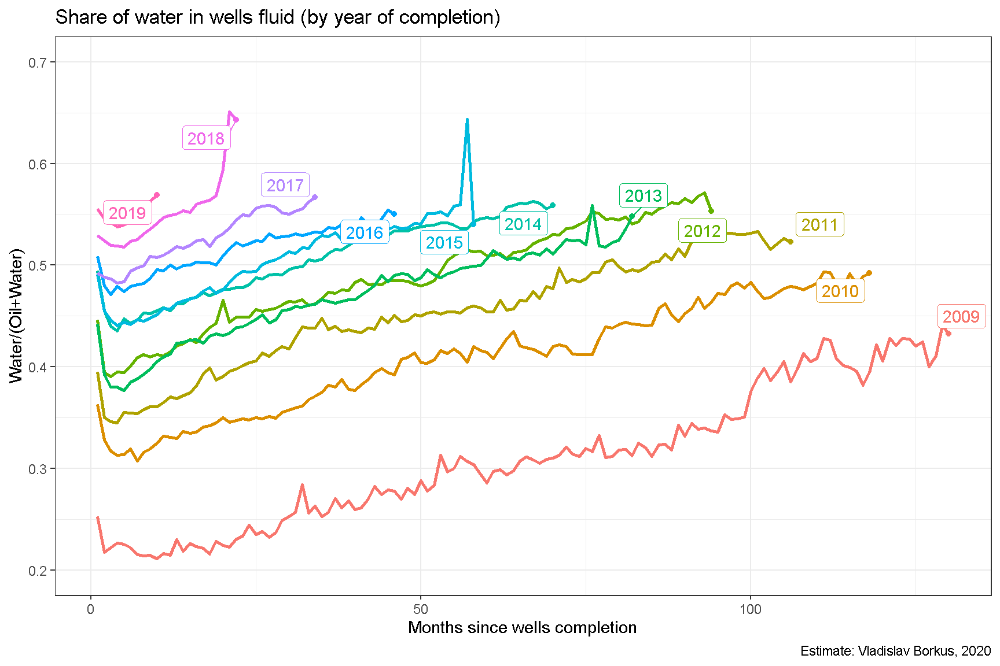

Добыча нефти на американских сланцевых месторождениях развивается уж более десяти лет, и накоплено достаточно информации для проведения пост-фактум анализа рентабельности подобных проектов. При их запуске, по крайней мере в начале "десятых" годов, предполагались довольно высокие цены на нефть, но эти ожидания не оправдались, цена нефти падала до очень низких значений. Так что получилось в итоге? В данном работе проведен анализ итогов добычи в Северной Дакоте (North Dakota, ND), первопроходце сланцевой разработки.

# Исходные данные

Для анализа я использую временные ряды, составленные из открытых данных, опубликованных в отчетах департамента нефти и газа Северной Дакоты: годовых, выпускавшихся до 2016 года в формате PDF @DMRNDGovYearlyReports, месячных отчетов в формате PDF, выпускавшихся до 2015 года, и месячных XLSX-отчетов, публикация которых началась с 2015 года @DMRNDGovMonthlyReports. Все эти отчеты дополняют друг друга (местами расходятся), так как сведения о скважинах, имеющиеся в одних из них, отсутствуют в других, и была проведена работа по стыковке этих данных и очистке их от явных ошибок. По счастью данные, наиболее влияющие на исследуемые показатели, т.е. данные по добыче нефти, представлены полностью.

Данные по цене нефти и газа в Северной Дакоте собирает Департамент Энергетики США, и они публикуются на его сайте. Данные по цене нефти WTI можно получить с сайта Федеральной Резервной Системы США. Цена на нефть в Северной Дакоте заметно ниже WTI, дифференциал доходил до \$15. @OilPriceND @GasPriceND1 @GasPriceND2 @GasPriceND3

Источники остальных данных будут указываться далее по тексту.

# Объемы добычи нефти

Первичный осмотр данных показывает, что наибольший вклад в добычу вносят всего две формации: BAKKEN и THREE FORKS (SANISH), т.е. сланцевые формации. На остальные скважины приходится около 1% добычи, хотя в них и расположено 24% скважин. При этом добыча из не-сланцевых формаций имеет свою специфику, они сильно искажают оценку экономики сланцевых проектов. Поэтому они были отфильтрованы и не рассматривались.

К настоящему моменту на месторождениях задействовано порядка 15000 скважин. Пик темпа роста этого показателя приходился на 2014 год. В 2019 году наблюдался новый локальный максимум, но эпидемия короновируса и связанное с ней падение спроса на нефть привело к сокращению числа новых проектов.

Часть открытых ранее скважин постепенно закрывается, и данные по ним перестают публиковаться. Вместе с тем доля таких скважин невелика, даже для скважин открытых 10 лет назад она составляет всего 2%.

# Характеристики добычи нефти

Для скважин, созданных в более поздние периоды, кривые добычи имеют в среднем более высокий начальный пик, но затем быстрее спадают.

Тоже самое можно увидеть на усредненных кривых кумулятивной добычи. Для сравнения на них отложен уровень абстрактной цены скважины в 10 М\$, пересчитанный в баррели нефти при разных ценах на нефть. Месторождения Баккена в целом добыли примерно столько нефти, чтобы окупить эту компоненту затрат, но не сильно более.

Пик распределения скважин по уровню добычи в первый год после завершения скважины смещается в сторону все больших дебитов, но при этом распределение становится шире, т. е. скважины все более непохожи друг на друга.

# Добыча газа

Производство и реализация газа с рассматриваемых формаций растет гораздо быстрее, чем производство нефти.

При этом кривые добычи газа для усредненной скважины спадают после завершения скважины быстрее, а пиковое значение усредненных кривых дебита в последние годы стало более, чем в 10 раз больше, чем в первые годы сланцевой революции.

Можно сравнить изменение пикового значения добычи газа и нефти в проектах, и убедиться, что для газа этот показатель растет быстрее, чем для нефти.

Этот беглый анализ позволяет утверждать, что месторождения становятся все в большей степени газовыми.

# Обводненность

На месторождениях наблюдается постепенный рост обводненности как старых проектов, так и новых. Это ставит под сомнение долговременные перспективы сланцевой добычи. С другой стороны, эта обводненность пока держится на относительно умеренном уровне, в среднем не больше 60%. Но, в свою очередь, для новых проектов это лишь стартовый уровень, через пять лет они будут уже очень сильно обводнены.

