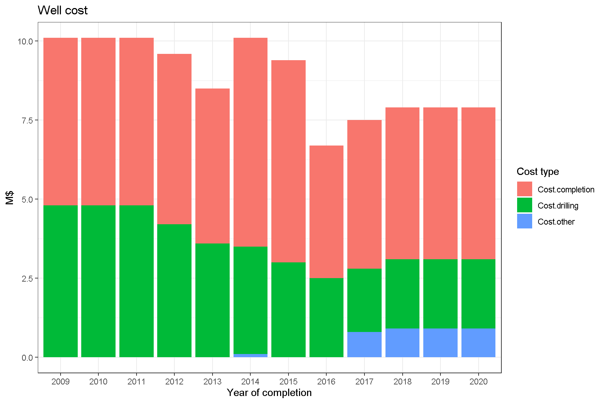
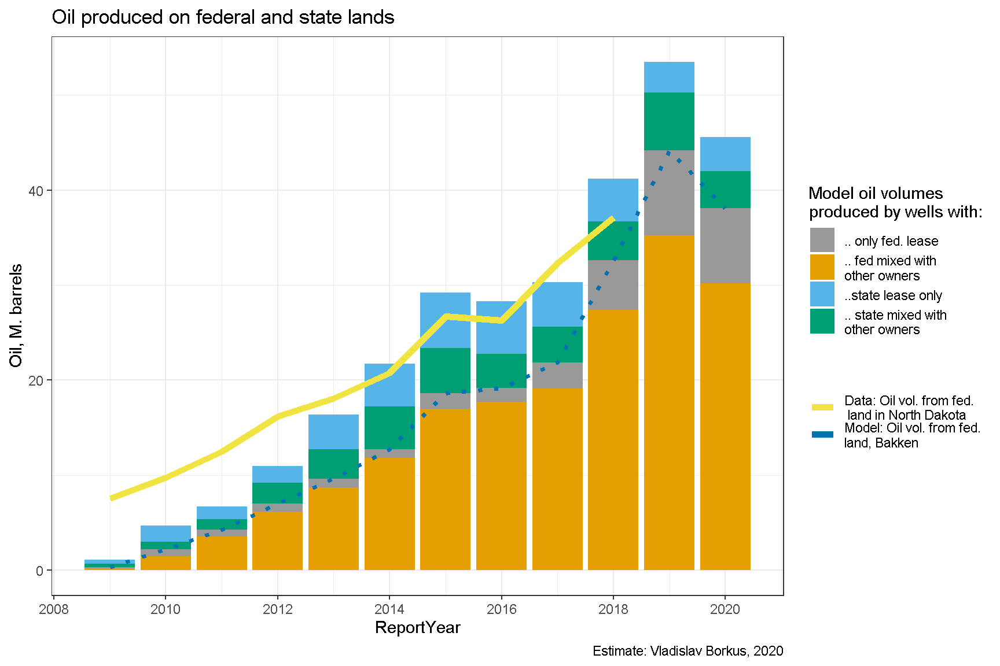
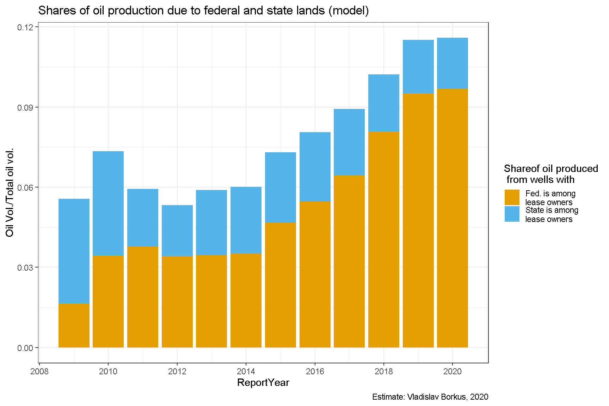
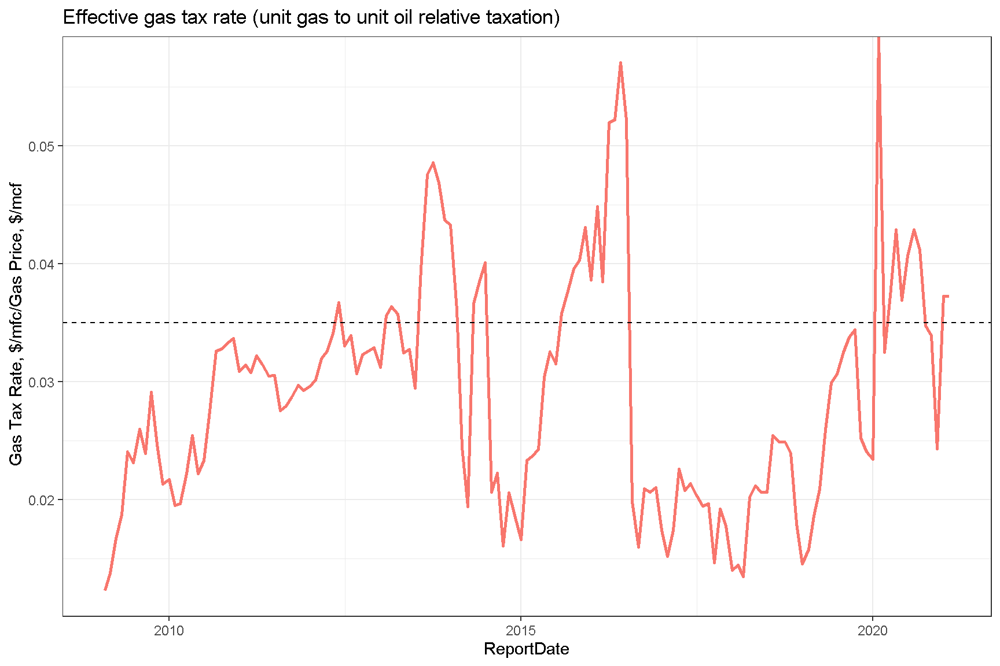
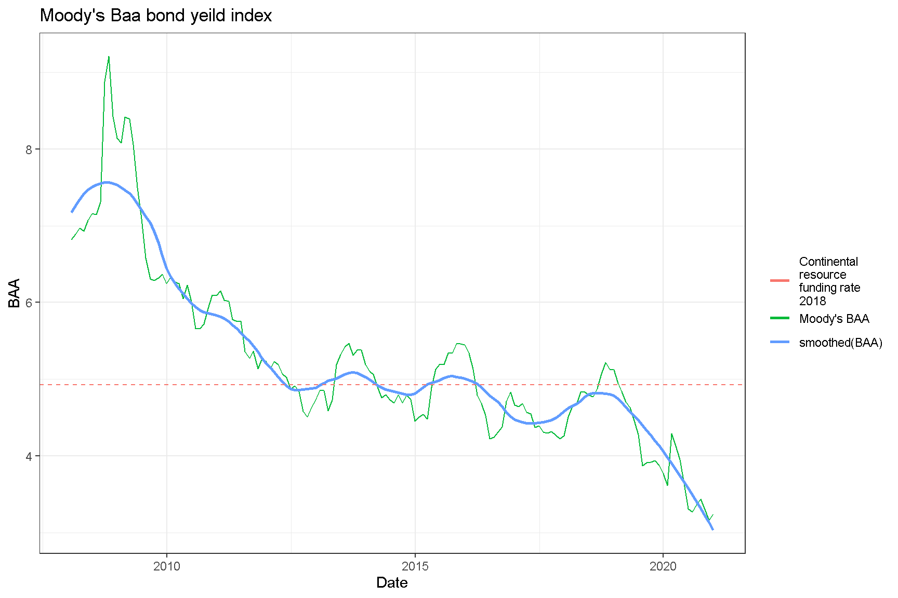
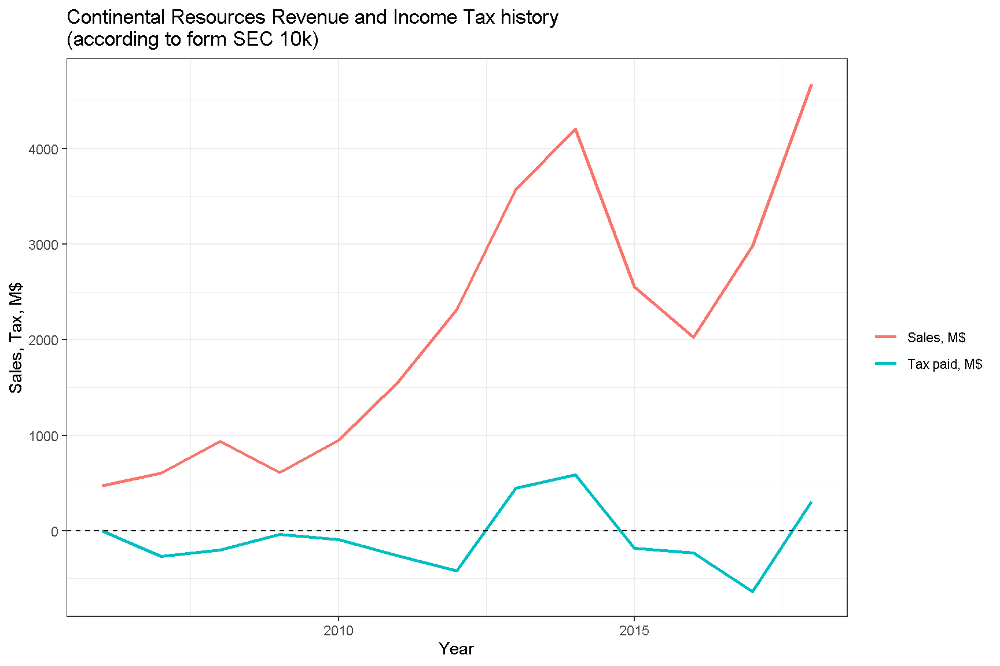

Ниже будут рассмотрены основные компоненты затрат на создание и эксплуатацию сланцевых скважин в Северной Дакоте, заложенные в модель оценки окупаемости проектов.

# Стоимость скважин

Основные первичные затраты приходятся на стоимость скважины. По мере совершенствования технологий она уменьшалась, и, согласно презентации компании Continental Resources @ContinentalResourcesPresentation, снизилась с 2011 по 2018 год на 22% - с 10,1 миллиона долларов до 7,9 миллиона. Для 2019-2020 гг. сведений найти не удалось, и цена скважины была принята при моделировании равной цене скважины 2018 г.

# Лицензионные платежи за минеральные ресурсы

## Бонусы и рентные платежи

Вторая существенная статья затрат - оплата лицензий владельцам минеральных ресурсов (т.е. участков, под которыми проходит скважина), которая складывается из "входного бонуса" и процентных платежей от стоимости добытой нефти (royalty). Каждому владельцу полагается доля дохода в зависимости от его доли в площади, обслуживаемой скважиной. Она директивно считается посекторно, для сланцевых горизонтальных скважин обычно составляет 1280 акров, согласно регулирующим нормам с одного акра нельзя добывать более 13 баррелей в месяц. Лицензионное соглашение заключается обычно раз в пять лет и каждый раз при этом выплачивается бонус. @NORTH_DAKOTA_OILGAS_LEASING_CONSIDERATIONS @royalty_buying_101 @royalty_clause

Ниже приведена таблица средних бонусов и рентных платежей, составленная по годовым отчетам Petroleum Industry's Economic Contribution to North Dakota за 2011, 2013, 2015 года. @PIECND2011 @PIECND2013 @PIECND2015

<table>
<caption>(\#tab:unnamed-chunk-3)Bonuses payments</caption>
 <thead>
  <tr>
   <th style="text-align:center;"> year </th>
   <th style="text-align:center;"> Total bonuses paid instate </th>
   <th style="text-align:center;"> Bonuses. State leases </th>
   <th style="text-align:center;"> Bonuses. Federal leases </th>
   <th style="text-align:center;"> Bonuses. Private leases </th>
   <th style="text-align:center;"> Total private leases paid </th>
   <th style="text-align:center;"> Royalty rate. Oil </th>
   <th style="text-align:center;"> Royalty rate. OilGas </th>
   <th style="text-align:center;"> N. new well </th>
   <th style="text-align:center;"> Bonuses per new well </th>
   <th style="text-align:center;"> Share of private bonuses </th>
  </tr>
 </thead>
<tbody>
  <tr>
   <td style="text-align:center;"> 2011 </td>
   <td style="text-align:center;"> 427.5 </td>
   <td style="text-align:center;"> 100.0 </td>
   <td style="text-align:center;"> 5.1 </td>
   <td style="text-align:center;"> 321 </td>
   <td style="text-align:center;"> NA </td>
   <td style="text-align:center;"> 17.58 </td>
   <td style="text-align:center;"> 17.35 </td>
   <td style="text-align:center;"> 1257 </td>
   <td style="text-align:center;"> 0.34 </td>
   <td style="text-align:center;"> 0.75 </td>
  </tr>
  <tr>
   <td style="text-align:center;"> 2013 </td>
   <td style="text-align:center;"> 427.5 </td>
   <td style="text-align:center;"> 49.6 </td>
   <td style="text-align:center;"> 4.1 </td>
   <td style="text-align:center;"> 300 </td>
   <td style="text-align:center;"> 737 </td>
   <td style="text-align:center;"> 17.52 </td>
   <td style="text-align:center;"> 17.43 </td>
   <td style="text-align:center;"> 1994 </td>
   <td style="text-align:center;"> 0.21 </td>
   <td style="text-align:center;"> 0.70 </td>
  </tr>
  <tr>
   <td style="text-align:center;"> 2015 </td>
   <td style="text-align:center;"> 59.4 </td>
   <td style="text-align:center;"> 14.4 </td>
   <td style="text-align:center;"> 4.1 </td>
   <td style="text-align:center;"> 43 </td>
   <td style="text-align:center;"> NA </td>
   <td style="text-align:center;"> 17.91 </td>
   <td style="text-align:center;"> 18.04 </td>
   <td style="text-align:center;"> 1548 </td>
   <td style="text-align:center;"> 0.04 </td>
   <td style="text-align:center;"> 0.72 </td>
  </tr>
</tbody>
</table>

Из приведенных данных видно, размер "бонуса" и процентной ренты менялись со временем, в начале "сланцевой революции" бонус был чуть больше, исчисляясь сотнями тысяч долларов, после падения цен на нефть стал чуть меньше. Процент же лицензионных платежей чуть подрос - с 17.4% до 18%.

Данные по размеру бонуса указывают на сильный разброс этого параметра - от 40 тыс./скважину до 330 тыс./скважину. На аукционах 2019 года в самом производительном графстве McKenzie большая часть предложений делается в районе от \$60 до \$250 долларов за акр, т.е. от 77 до 320 тыс. долл. за скважину (1280 акр).

Соотношение между бонусом и процентными платежами - это баланс между авансом и последующими платежами. Для простоты анализа я положил в своей модели бонус равным 200 тыс. долл., а рентную ставку положу равной некой промежуточной величине 17.7%.

## Вычеты для федеральных земель и земель штата

Если рентные платежи производятся федеральному правительству, штату или муниципальному образованию, то их можно вычесть из налогов на добычу ископаемых (см. ниже). Также ставка по рентным платежам для федеральной земли меньше, чем в частном секторе и законодательно фиксирована на уровне 12.5%, а ставка рентного платежа штата составляет 18.75% @FedLeaseRate (подробности лицензирования можно найти в @NDMineralAuctionsForms).

Таким образом для окупаемости конкретного проекта нахождение на федеральной земле может быть важным (до 6% = 5.5% экономии на royalty плюс еще 10%\*5.5%=0.55% налоговой экономии - см. ниже), но в целом для портфеля колебание доли федеральной земли даже на 10% оказывает влияние на чистый доход менее 1%:

-   Увеличение дохода за счет снижения размера royalty составляет 10%\*5.5% = 0.55%.

-   Увеличение дохода за счет снижения налогооблагаемой базы составляет 10%\*0.55% = 0.055%.

Доля нефти, добытой на федеральной земле, согласно данным федерального казначейства колебалась в районе 8-10% (см. ниже). По всей видимости еще несколько процентов приходится на земли штата и муниципалитетов.

Сложность моделирования этой статьи затрат состоит в том, что одна и та же горизонтальная скважина может находиться на участках в разной собственности, в том числе одновременно проходить и под частной и под федеральной землей, более того эти участки могут в менять со временем владельца. На качественном уровне вычислить основного владельца лицензии можно благодаря правилу, согласно которому он указывается первым в имени скважины, а второй лицензиат вторым в ее имени. Хотя точные доли владения так установить нельзя, но можно провести оценку в среднем по Штату. Так, регрессия объемов добычи на федеральной земле к объему добычи на скважины с частным и государственным владением лицензией, позволяет оценить среднюю за период долю государства в скважинах со смешанным типом лицензий в 0.47. Это значение я приму для модели.

Таким образом будет использовано следующее правило:

-   Если в названии скважины фигурирует только указание на владение лицензией государством или штатом, то ее экономика будет считаться как если бы она была на 100% государственной земле;

-   Если в названии скважины фигурирует частные лицензиаты как основные, то экономика будет рассчитываться исходя из доли государства в 0.53, а если как вторичные, то из доли в 0.47;

-   Если же в названий нет указаний на штат или государство, то экономика скважины будет рассчитываться как для полностью частной лицензии.

# Приобретение участка

Кроме покупки лицензии на минеральные ресурсы необходимо приобретение наземного участка для размещения оборудования и получения права требования заключения лицензионных соглашений. В среднем сделки осуществлялись по цене \$8000-10000 за акр, на скважину (точнее площадку, на которой может быть несколько скважин в разные пласты и стволов, идущих в разных направлениях) требуется 160 акр. В некоторых случаях цена доходила до \$20000 за акр. При размере участка 160 акр это означает 1,6 миллиона долларов затрат. Учет этого параметра сложен, так как с одной площадки может исходить несколько стволов. Визуальный осмотр ArcGIS-система Северной Дакоты @NDArcGIS показывает, что в среднем из одной точки сходит три ствола, потому для одной скважины в модели я буду использовать значение 500 тыс. долл.

# Налоги на добычу нефти

Третья важная компонента себестоимости добычи - это налог штата (по сути налог на добычу полезных ископаемых). Он состоит из двух частей: gross production tax (5%) и oil extraction tax (6.5% до 2016, 5% после), взимаемые от стоимости добытой нефти. @NDFAQ

В расчете этих налогов есть много особенностей.

1.  Если скважина находится на федеральной (сюда входят, например земли индейских резерваций), муниципальной земле или на земле штата, то налогоблагаемую базу GPT (и OET) можно уменьшить на размер рентного платежа.
2.  После 2015го ставка OET была снижена до 5%. @LetterTaxCommisioner
3.  Для скважин, производивших менее 35 баррелей в день (stripper wells) в течении предыдущих 12 месяцев, есть налоговый вычет - они могут быть квалифицированы как исключения (exemptions) и gross extraction tax за них не платится. До 2013 года этот порог составлял 30 баррелей в день. Формально требуется так же, чтобы глубина скважины превышала 10000 футов, что соответствует глубине залегания Middle Bakken, который в основном и разбуривается, так как это дает возможность получать нефть одновременно и с более высоко лежащих (Upper Bakken) и более низколежащих (Lower Bakken) пластов. @NDOilGasIcentives @HeadwatersEconomicsNDTaxPolicies Этот налоговый вычет существенен для тысяч сланцевых скважин.
4.  Применяется повышенная ставка gross extraction tax если цена нефти пять месяцев держится выше триггерной цены, корректируемой на инфляцию, но за весь период это так и не случилось. @TaxTriggerWontHit.
5.  Есть налоговые вычеты для горизонтальных скважин вне BAKKEN и THREE FORKS, но сами эти скважины я в этом исследовании не рассматриваю.

Чем выше возраст скважины, тем чаще она получает налоговый вычет в связи с низкой производительностью. Доля в производстве нефти у таких скважин сейчас около 40%.

# Налоги на добычу газа

Налог на газ вычисляется по таблицам в расчете на mcf @NDGasTax, в среднем составляет 3.5% от выручки от продажи газа.

# Текущие расходы

Текущие расходы (OPEX) состоят из двух частей - производственные расходы и административные (и прочие общие). Из отчетности добывающих компаний следует, что эти расходы были выше до 2014 года включительно, а потом заметно сократились. У Continental Resources производственные расходы были \$5.6 долл/баррель в 2014м (в 2010-2013 они колебались между \$5.5 и \$6.1), \$3.6 в 2018м. Административные расходы - около \$2 после 2014 го, между \$2.9 и \$3.1 до 2014го. Аналогичные показатели у компании EOG Resources. Упрощенно я буду полагать операционные расходы равными \$8 до 2014го включительно и \$5.6 после. @SEC10KContinental1 @SEC10KContinental2 @EOGFinacialReport

# Стоимость капитала

Ну, и, наконец, если скважины строятся на заемные средства, то имеются расходы на процентные платежи по облигациям. Как правило нефтяные компании фондируют свои операции при помощи выпуска облигаций (в принципе это основной канал их фондирования, так же они привлекают капитал через акционирование). В модели я буду использовать модель с многолетними облигациями, по которым ежемесячно платится фиксированный процент, а в конце выплачивается основное тело займа.

У Continental Resources стоимость фондирования составляла 5% в декабре 2015м, в основном (на 95%) состояла из облигаций со сроком погашения 10 лет (см. отчет SEC 10k за февраль 2016го, раздел Contractual Obligations). В 2018г ставка составляла уже 4.5% (см. форму SEC 10k за 2019 г.). Сопоставимые ставки долга имеет и другая добывающая компания - EOG Resources @EOG10K2015

Стоимость фондирования для каждого из проектов оценить довольно сложно, кроме того компании привлекают средства, выпуская свои акции, компании активно оптимизируют портфель займов, что вносит дополнительные трудности (например, упомянутой отчетности EOG Resource указаны и займы и под 6.7%, и под 2.5% годовых), поэтому далее я использовать ставку Moody's BAA, примерно соответствующей средней ставке фондирования, по которым занимает Continental Resources.

# Налог на прибыль

Помимо перечисленных расходов компании платят еще налог на прибыль компаний. Учеcть его при моделировании, однако, крайне затруднительно. Во-первых, этот налог начисляется на бухгалтерскую прибыль, т.е. вложения вычитаются из налогооблагаемой базы не сразу, а постепенно, по мере амортизации активов, поэтому компании платят его даже если долгосрочно их проекты убыточные или наоборот, могут получить налоговый возврат. Во-вторых, компании платят его не с проектов, а со всей своей деятельности, которая как правила ведется разных штатах.

Тем не менее на примере компании Continental Resources можно примерно оценить его влияние. Данные можно почерпнуть из форм SEC 10k, формируемых ежегодно. @Continental10K

Как видим доля этого налога в выручке относительно невелика - в годы максимальных цен он достигал 15%, но в годы убытков эти же суммы возвращались. В среднем он составлял 2% от всей выручки компании за весь период. Это примерно примерно 200 тыс. в расчете на скважину, что не может кардинально изменить вышеприведенные выводы о доходности портфелей проектов. Учитывать его в моделировании я потому не буду.

# Повторный гидроразрыв

Еще одной крупной статьей затрат является повторный гидроразрыв, который активно проводится на старых скважинах. В источниках указываются оценки от \$1.25 миллиона до "30% стоимости скважины". Я буду использовать в модели умеренно консервативную оценку в \$1.5 миллиона. Статистике по гидроразрывам будет посвящена отдельная глава.
