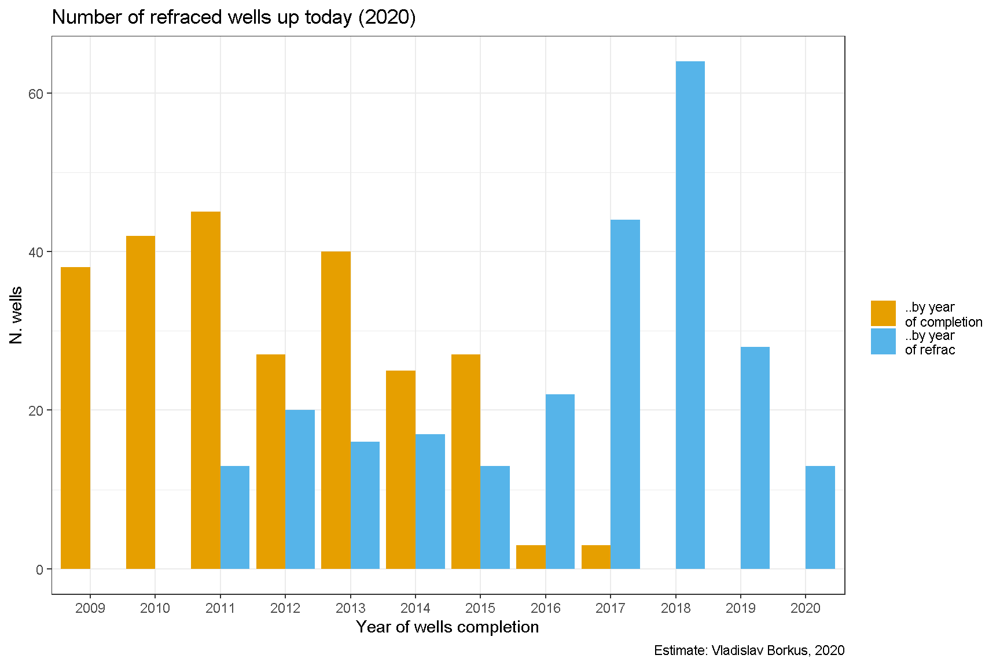
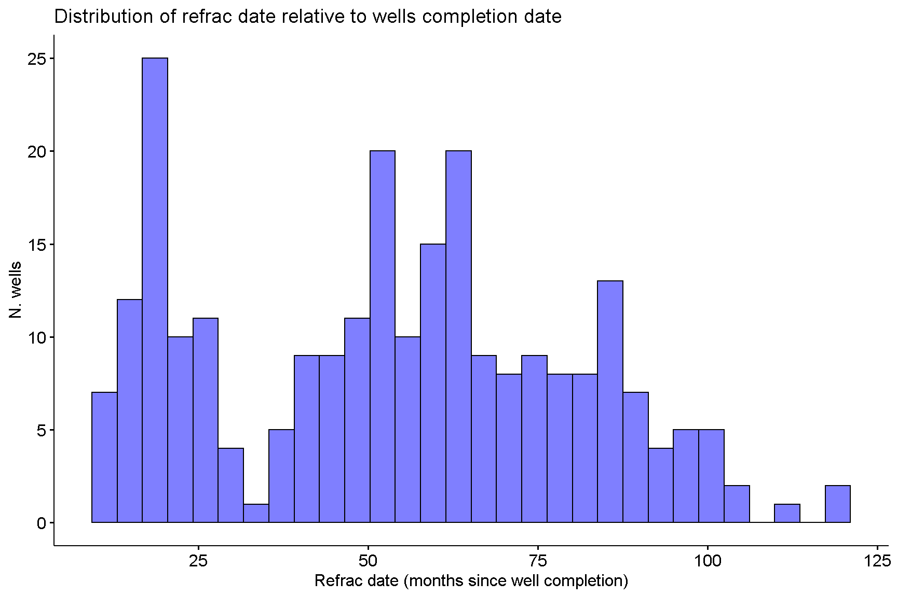
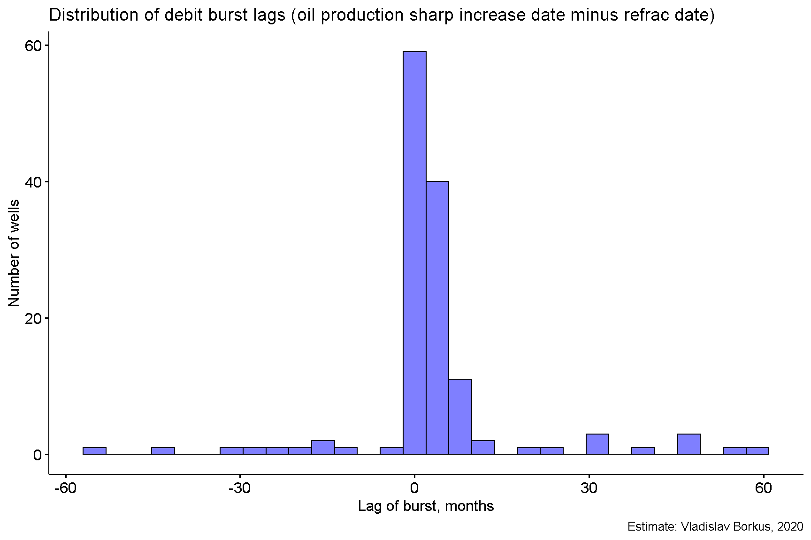
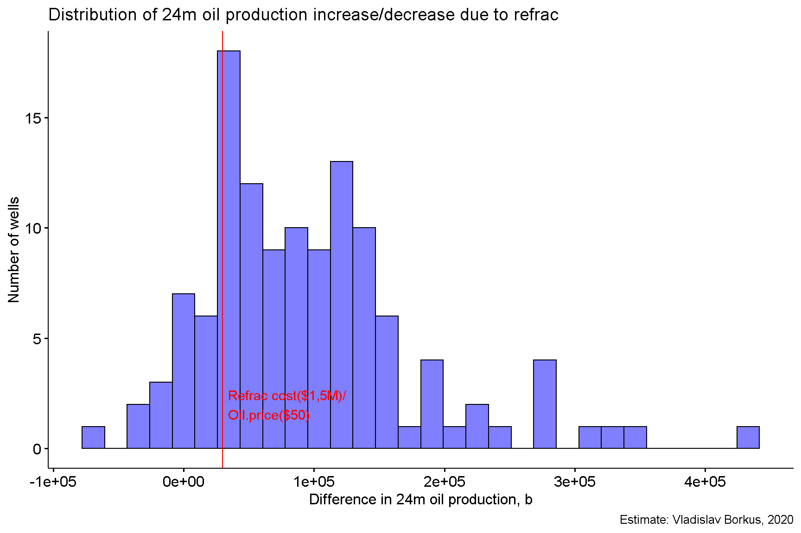
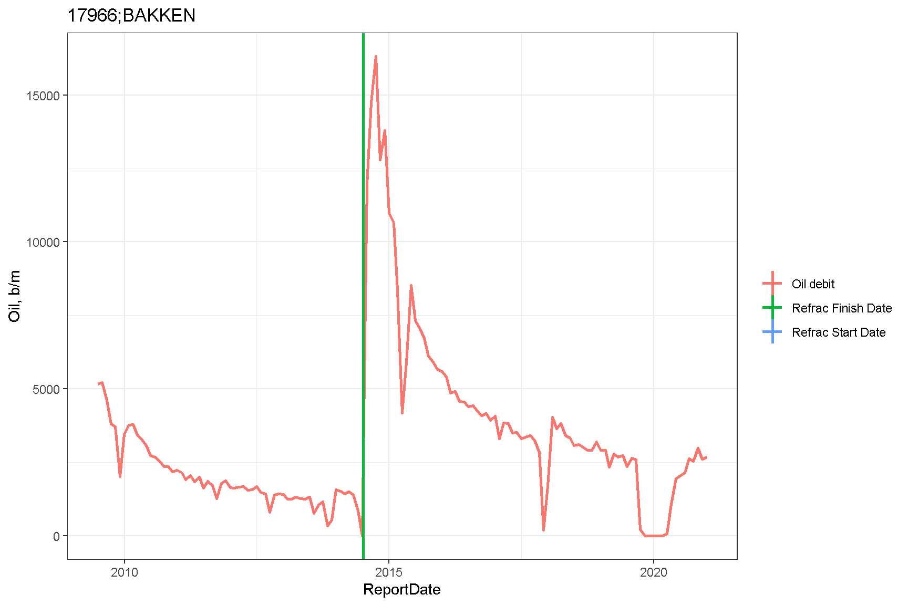
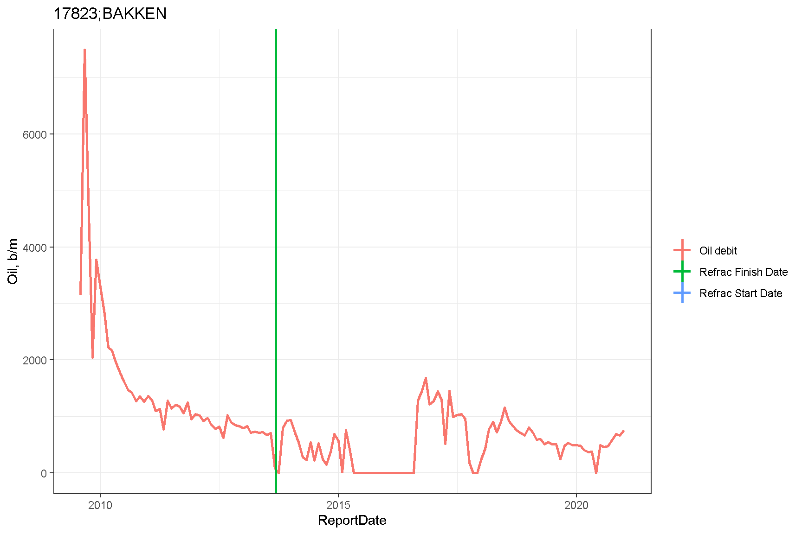

# Статистика повторных гидроразрывов

Исследование кривых добычи показывает, что на заметном их числе присутствуют резкие скачки (увеличение) дебита, после которых добыча может оставаться на повышенном уровне длительное время. Это явление может возникать по разным причинам: проведения гидроразрывов на соседних скважинах (сланцевые скважины расположены достаточно плотно, чтобы это стало возможным), увеличении естественного притока нефти если скважина не работала какое-то время, проведение повторного гидроразрыва на данной скважине. @RefracOrNot

Различать эти причины нужно потому, что в первых двух случаях владелец скважины получает доход не вкладывая дополнительных средств, а в последнем - оплачивает проведение гидроразрыва.

Наиболее точно причину увеличения добычи можно установить сделав выборку из бесплатной базы гидроразрывов FracFocus @FracFocus, выделив из нее те работы, которые завершились гораздо позднее официального начала эксплуатации скважины (я выбрал критерием год). По такому признаку найдено более 250 скважин скважин (230 в рассматриваемом датасете BAKKEN/THREE FORKS). (Часть из них, возможно, является на самом деле открытием новой скважины или ствола на той же площадке и работающей на том же пуле, но определить это из этих данных невозможно).

На большинстве скважин повторный гидроразрыв, согласно этой базе, происходит не менее чем через 3 года после завершения скважины. Однако на заметном их числе его дата отстоит от даты завершения не более чем на 2 года. Причем более подробный анализ показывает, что на таких скважинах часто потом действительно происходит резкое увеличение оттдачи, т.е. это не артефакт сбора статистики. 

Повторный гидроразрыв до сих пор является искусством и не гарантирует повышение дебита скважины. В ходе моделирования я проводил поиск неожиданных значительных всплесков добычи, и только в половине случаев после повторного гидроразрыва случаются скачкообразное увеличение добычи нефти из скважины. Также ни одного резкого увеличения добычи не выявлено на скважинах, на которых повторный гидроразрыв не проводился.

<table>
<caption>(\#tab:Refrac-debit-burst-stat)Refrac & debit bursts statistics</caption>
 <thead>
  <tr>
   <th style="text-align:center;"> Refraced </th>
   <th style="text-align:center;"> Bursts </th>
   <th style="text-align:center;"> Number of wells </th>
  </tr>
 </thead>
<tbody>
  <tr>
   <td style="text-align:center;"> Yes </td>
   <td style="text-align:center;"> Any </td>
   <td style="text-align:center;"> 241 </td>
  </tr>
  <tr>
   <td style="text-align:center;"> Yes </td>
   <td style="text-align:center;"> Yes </td>
   <td style="text-align:center;"> 126 </td>
  </tr>
  <tr>
   <td style="text-align:center;"> Yes </td>
   <td style="text-align:center;"> No </td>
   <td style="text-align:center;"> 115 </td>
  </tr>
  <tr>
   <td style="text-align:center;"> No </td>
   <td style="text-align:center;"> Yes </td>
   <td style="text-align:center;"> 0 </td>
  </tr>
  <tr>
   <td style="text-align:center;"> Any </td>
   <td style="text-align:center;"> Yes </td>
   <td style="text-align:center;"> 241 </td>
  </tr>
</tbody>
</table>

Кроме того, оказывается, что много скважин на которых происходит не резкий скачкообразный рост добычи, а плавный, длящийся продолжительное время. Это видно, если посчитать разницу в суммарном дебите за 24 месяца, следующих за гидроразрывом, и 24 месяца, предщестующих ему. Для большей части скважин эффект от дополнительной добычи получается больше вероятных затрат на повторный гидроразрыв. 

# Примеры результатов гидроразрывов

Ниже приведены примеры повторного гидроразрывов, приводящего к резкому и умеренному росту дебита.

Резкий рост добычи.

Слабый рост.

