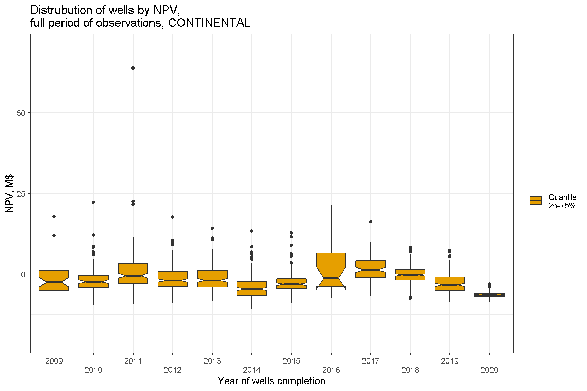
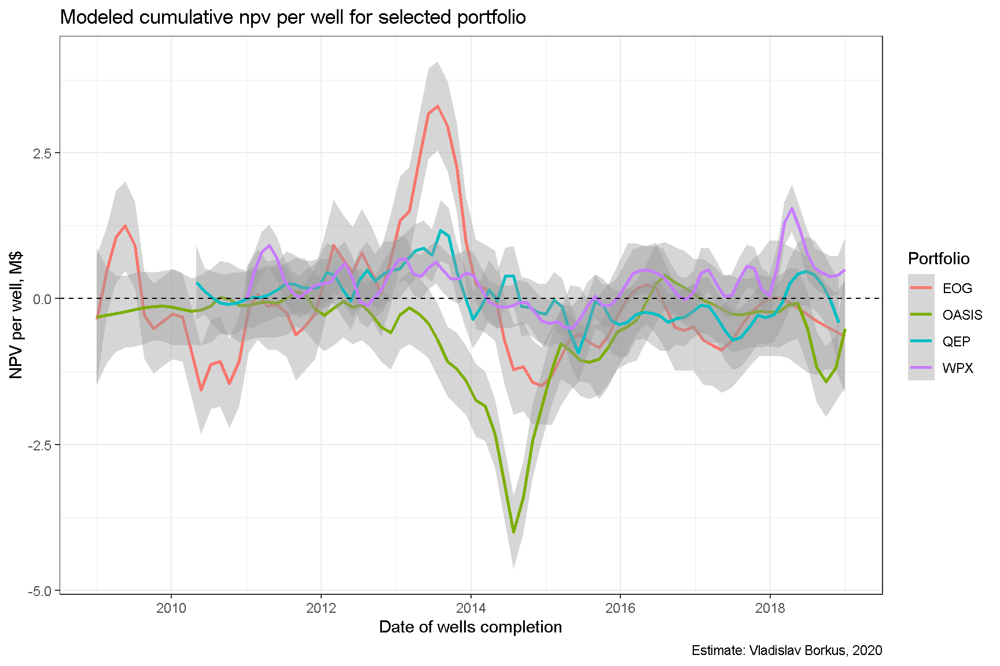
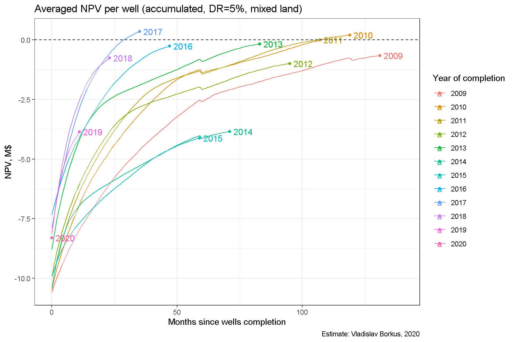
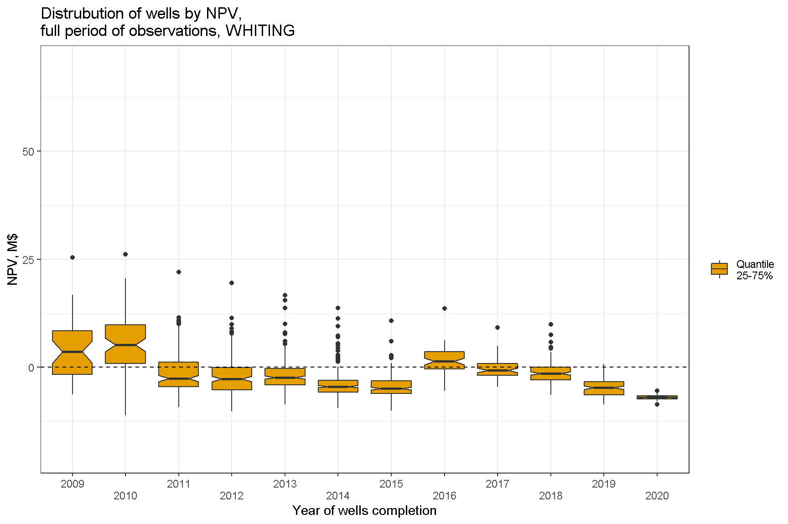
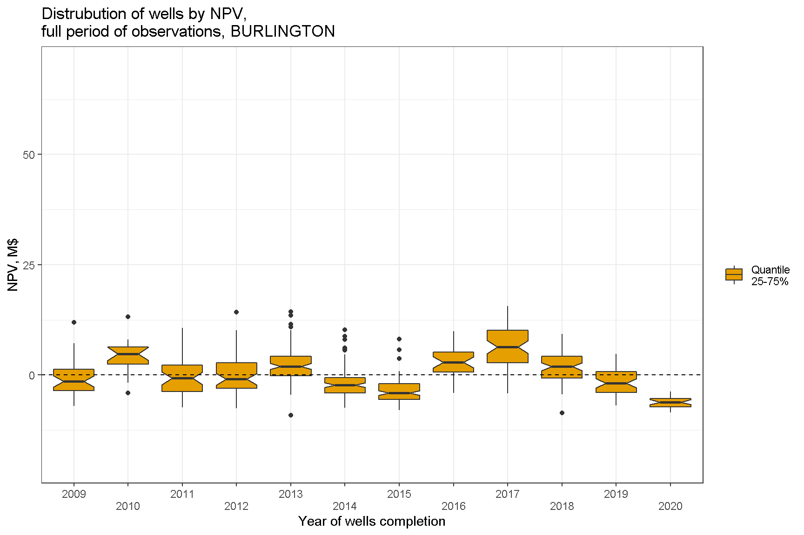
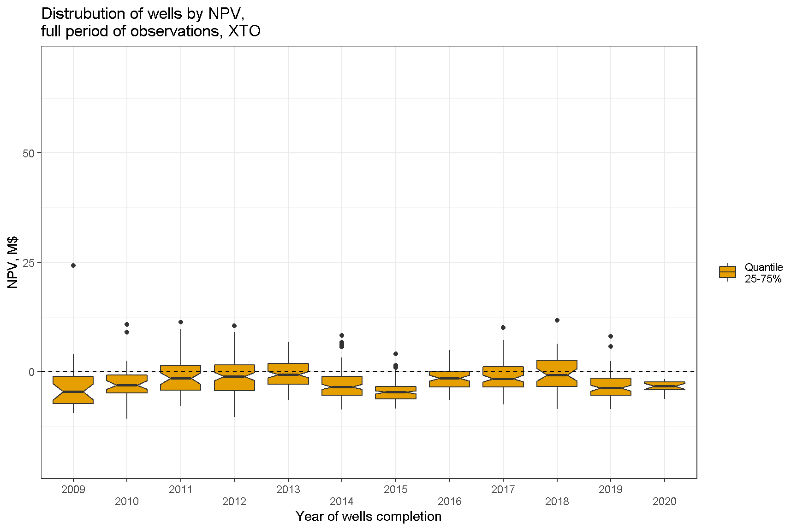
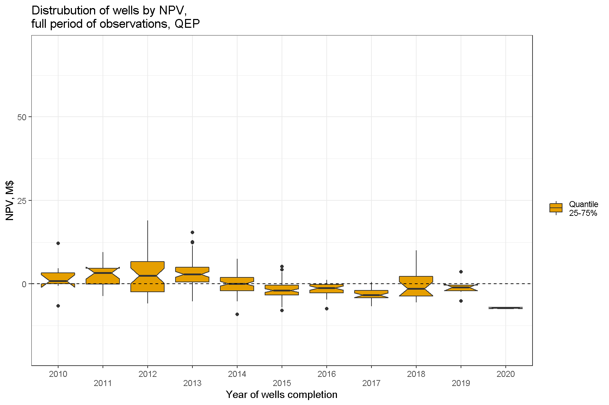

# Выбор данных для анализа

Портфель проектов представляет собой группу проектов, имеющих общее управление и финансирование, т. е. относящихся к какой-то одной компании-владельцу. Управление сразу пулом проектов позволяет уменьшить инвестиционные риски, покрывая убытки по одним проектам доходами по другим. Для портфелей можно уже оценивать такие показатели как долговая нагрузка.

Так как скважины переходили из рук в руки, то структура портфелей проектов изменялась со временем. Часть скважин продавалась, другие покупались. Так как цены продажи проектов не известны, то неизбежна неопределенность в оценке финансовых показателей. Чтобы ее уменьшить, далее будет принято упрощение, согласно которому скважина приписывается к портфелю по ее первому владельцу. Второе упрощение - рассматривались только портфели, которые менялись несильно, что позволяет соотносить рассчитываемые показатели с реальными показателями бизнесов. Критерием "несильности" будет служить требование, чтобы доля объема нефти, добытой в скважинах, сменивших владельца, к общему объему, добытому скважинами портфеля, не превышала 3%.

Такие упрощения приводят к тому, что оценки модели будут соотноситься с реальностью только в отношении крупных производителей, которые, однако, дают в сумме около 72 % всей добытой нефти месторождения. Таких компаний оказалось 10.

## Распределение NPV в портфелях

Разбивка скважин по портфелям позволяет выявить, что разные компании по разному угадывали качество будущих скважин. У некоторых из них мало "звезд", но зато стабильно-удачные вложения. Другие действовали более рискованно - у них большая доля неокупившихся вложений, но зато есть и мегаудачные, покрывающие убытки по десяткам убыточных скважин.

## NPV портфелей по месяцам завершения скважин

Можно также оценить сколько заработали те или иные портфели скважин в зависимости от месяца запуска. Вполне ожидаемо доходы и убытки в портфеле примерно балансируют друг друга, а наиболее убыточным периодом инвестиций оказывается 2015-2016 гг.

## Отрасль в целом

Ну и, наконец, можно задаться вопросом о доходности этой отрасли в целом. На диаграмме ниже приведены траектории NPV суммарно по всем скважинам, открытым в какой-то год[^1]. Как видим, в целом достичь положительной доходности могут только инвестиции в отрасль последних пяти лет, но не первых лет "сланцевой революции".

[^1]: Небольшой скачок кривых на 60-м месяце соответствует единовременной выплате бонуса за землю, которая, согласно модели производится каждые пять лет.

На этом можно завершить с рассмотрением показателей NPV, и далее перейти к моделированию реальных денежных потоков портфелей.

-----

# Appendix. NPV скважин портфелей. Дополнительные диаграммы

