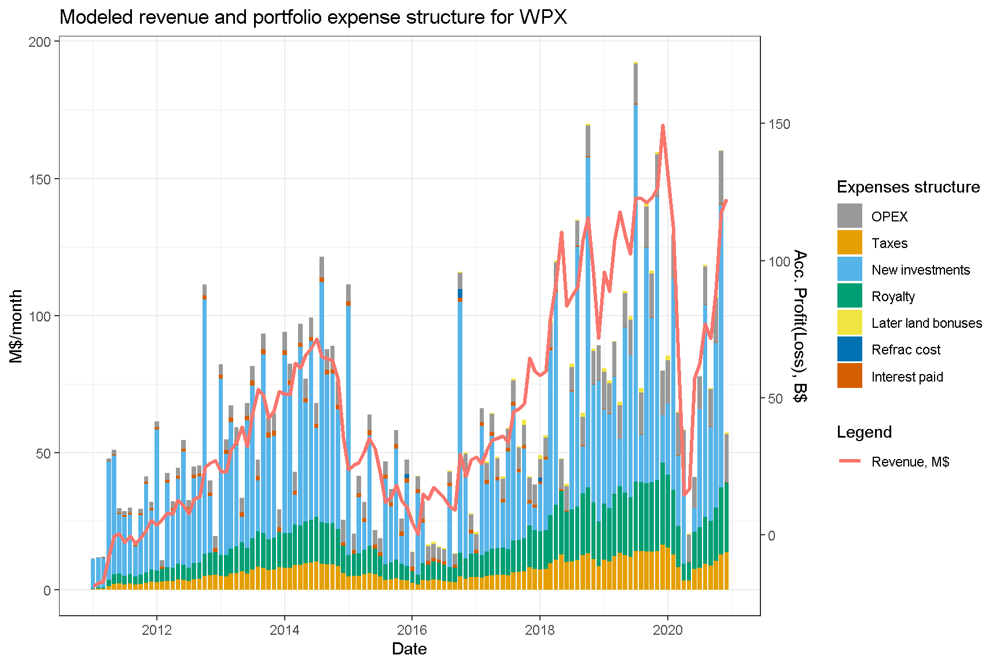
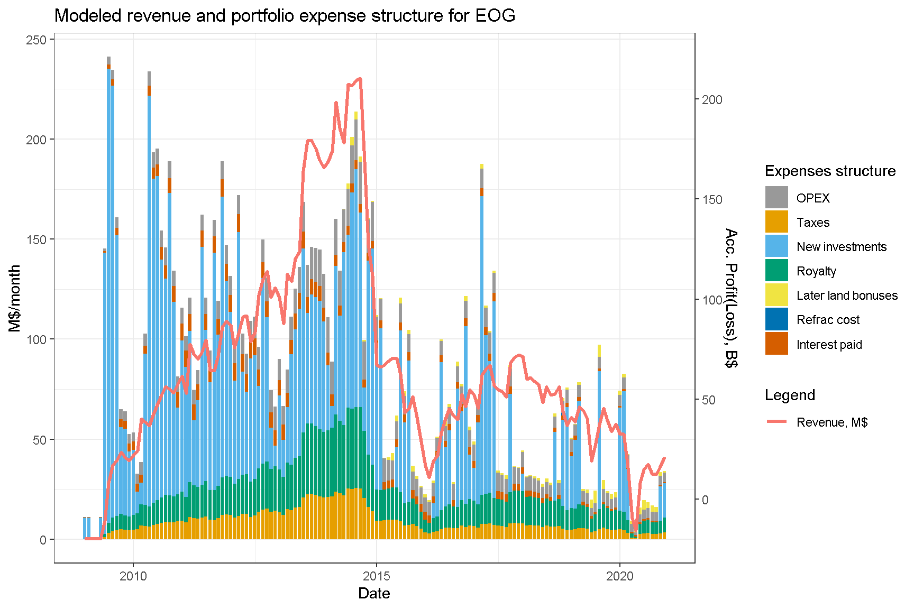
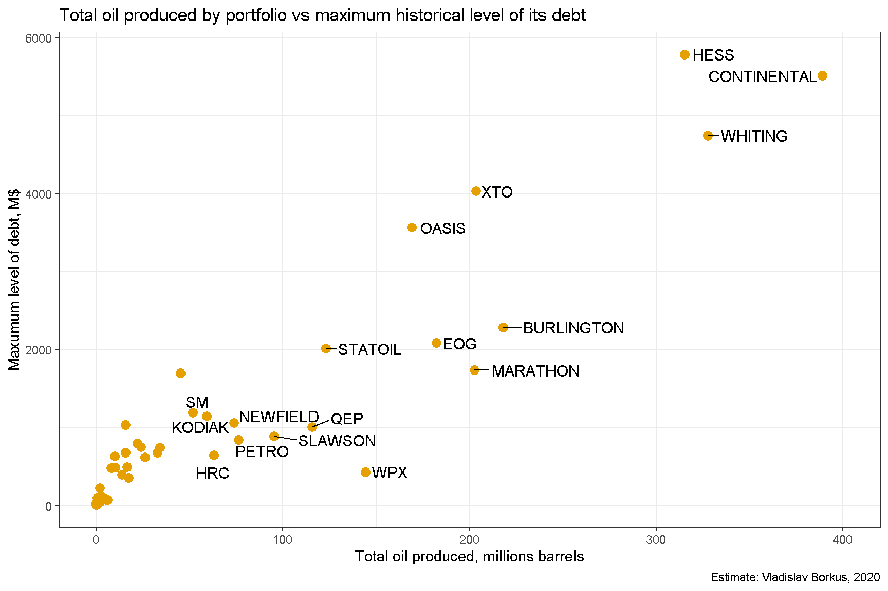
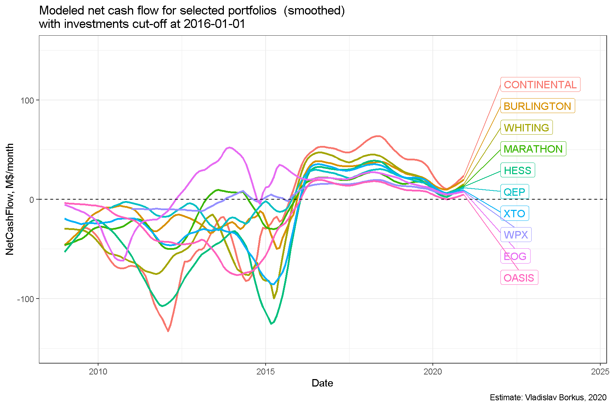
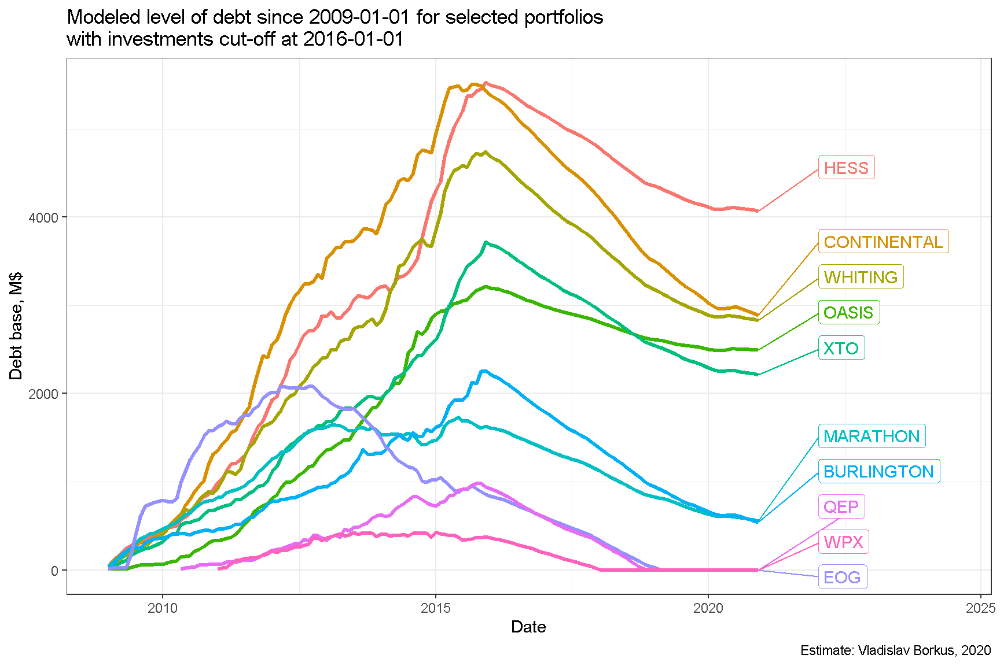
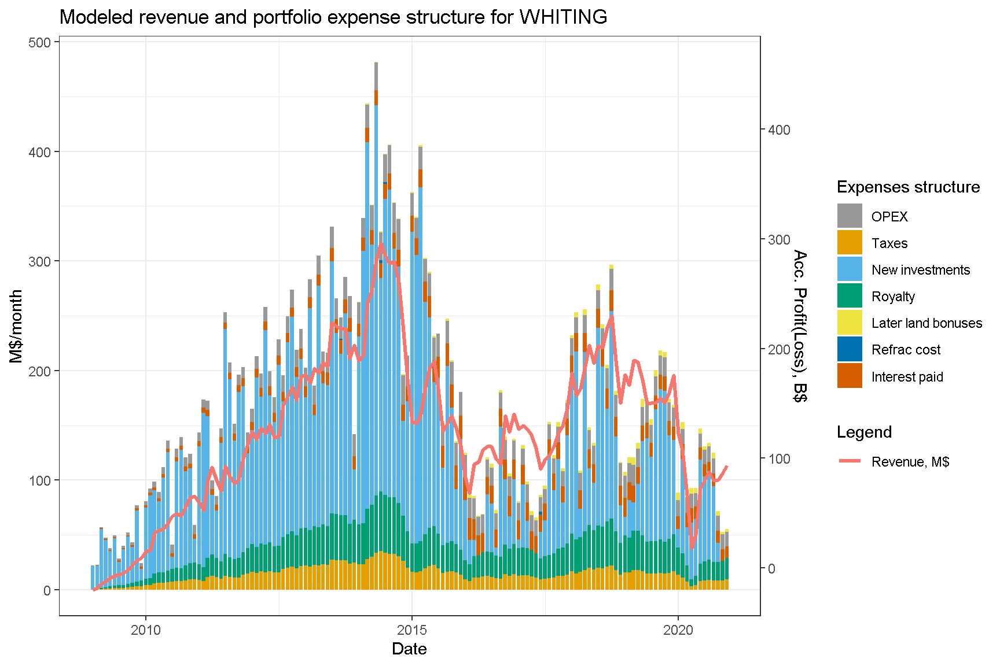
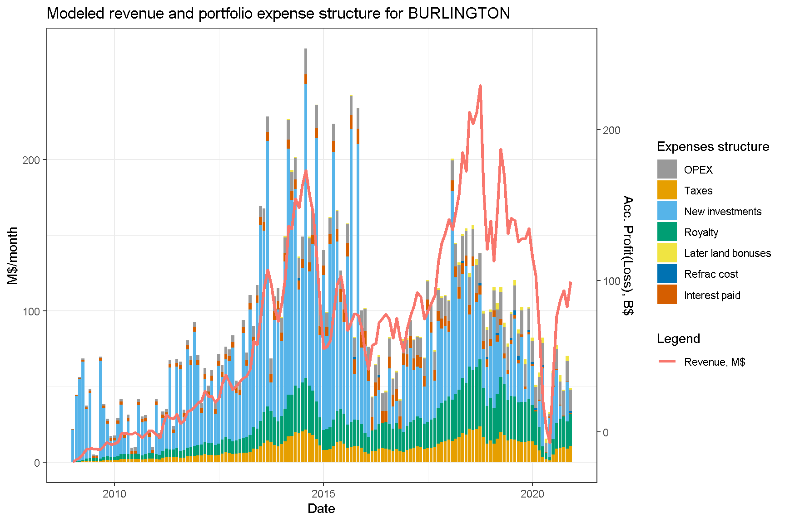
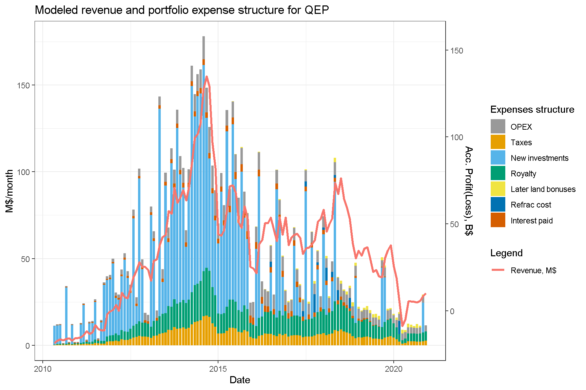

# Структура доходов и расходов портфелей проектов

Ниже приведены оценки доходов и расходов по проектам нескольких крупнейших производителей. В данной модели считается, что если текущие доходы превышают расходы, то вся разница идет на сокращение долговой нагрузки (речь естественно идет о долге портфеля проектов, а не всей компании), а если доходы ниже расходов, то долг растет.

До кризиса нефтяных цен 2014 года компании тратили на инвестиционную деятельность больше, чем позволяли их текущие доходы, наращивая долг. После этого кризиса, они перешли к другой модели, в которой их доходы как правило превышали все расходы, включая инвестиции.

# Чистый денежный поток, генерируемый портфелями проектов

Как было отмечено выше, до 2014 года чистый денежный компаний был отрицательным, в последние пять лет он стал, как правило, положительным.

# Уровень долговой нагрузки

Зная структуру доходов и расходов в портфелях компаний можно оценить как эволюционировала их долговая нагрузка. Портфели, в которых прекратили открывать новые проекты в Северной Дакоте, наподобие EOG, изрядно сократили долг. Часть компаний, продолжавших активные инвестиции, должны по этим расчетам сохранить достаточно высокий уровень долга, но ряд компаний смогли сочетать высокую инвестиционную активность с существенным снижением долговой нагрузки.

Остаточный суммарный долг десятки выбранных производителей можно оценить примерно в 22 B\$.

Как правило, чем больше компания добывает нефти, тем выше был ее пиковый долг, что вполне ожидаемо, несмотря на различия в эффективности скважин.

# Сколько всего заработано?

Можно также оценить баланс заработанного и потраченного производителями к текущему моменту. В большинстве случаев он оказывается отрицательным, в основном из-за ошибочных инвестиций в 2014-15 гг.

# Способность обслуживать долг

Выяснение способности компаний обслуживать накопившийся долг требует построения прогноза добычи и инвестиций, который будет крайне чувствителен к заложенным в него предположениям. Более простой подход состоит в проведении численного эксперимента по пост-фактум данным: можно остановить в какой-то момент инвестиции и посмотреть эволюцию основных параметров портфелей. Ниже приведены диаграммы для случая, когда инвестиции остановлены 1 января 2016 года.

Денежный поток всех портфелей оказывается положительным, и может быть использован на сокращение долга.

Вместе с тем темп сокращения долга довольно невысокий, и в течении 5 лет полностью погасить долг удалось бы не всем производителям. Например, для портфеля Continental дополнительное сокращение долга составило бы всего 1.1B\$. Выручки не хватило бы, чтобы вернуть долг целиком.

Соответственно, и финансовый итог деятельности компаний не стал бы положительным.

# Выводы

Приведенные диаграммы подтверждают уже сделанный вывод: доходность как отрасли в целом, так и крупных добывающих компаний оказалось невысокая. Она достаточна для обслуживания расходов и долга, но не получения прибыли. Основным виновником убытков являются ошибочные инвестиции 2014-2015 гг., которые не окупятся никогда.

После 2016 г. большинство компаний изменило инвестиционную стратегию и вкладывают в новые проекты меньше, чем зарабатывают. Это привело, согласно модели, к их положительному денежному потоку, и сокращению долга по их портфелям проектов. Реальный долг может оказаться еще ниже, так как некоторые компании прибегали к тактике реструктуризации и списания части долга, которая в данном моделировании не рассматривалась.

Компании, прекратившие активные инвестиции в сланцевую добычу в Северной Дакоте, смогли, согласно данной модели, сократить долг. Однако, моделирование такого шага для других компаний показывает, что эффект для них был бы гораздо слабее, и если бы они прекратили инвестиции начиная с 2016 года, то выплатить долг полностью, вероятно, не смогли бы.

------------------------------------------------------------------------

# Appendix. Дополнительные диаграммы структуры доходов портфелей.

