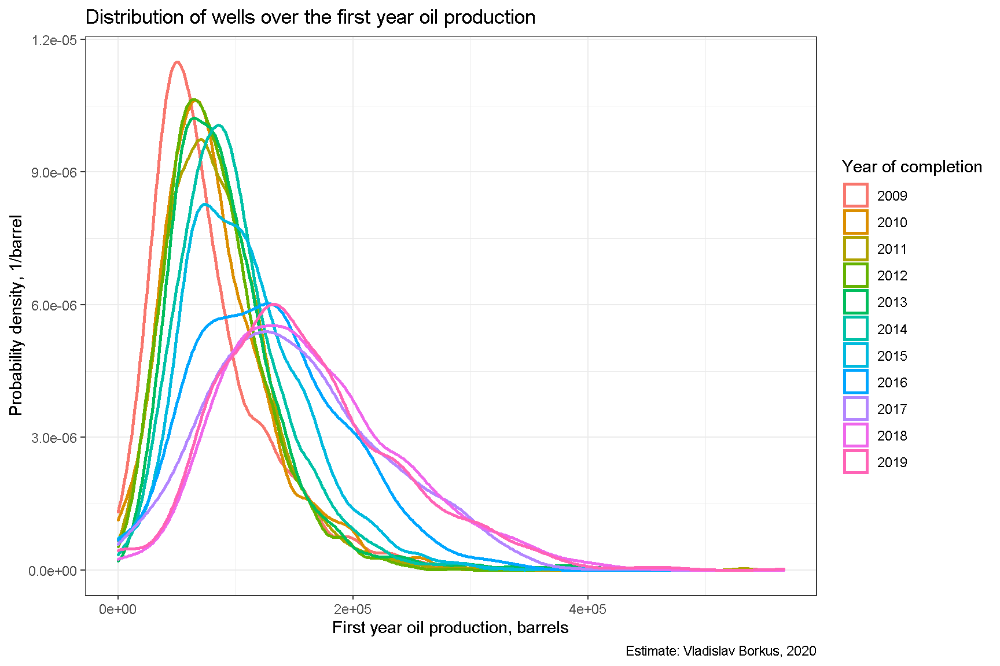
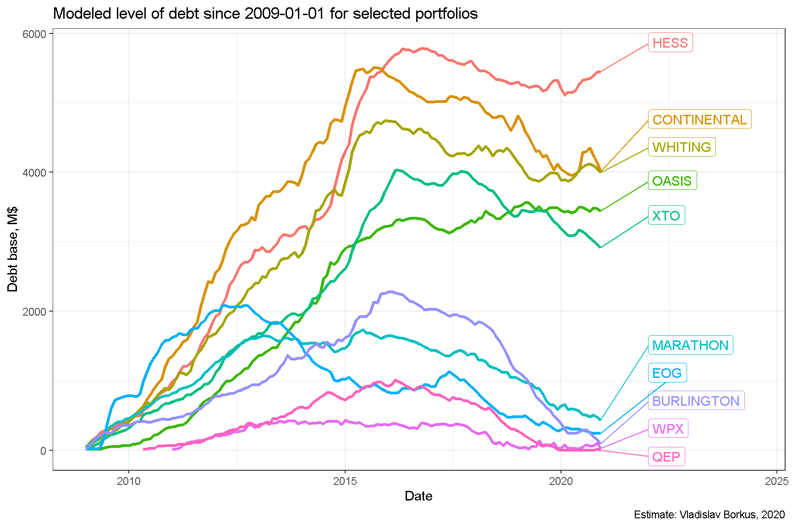
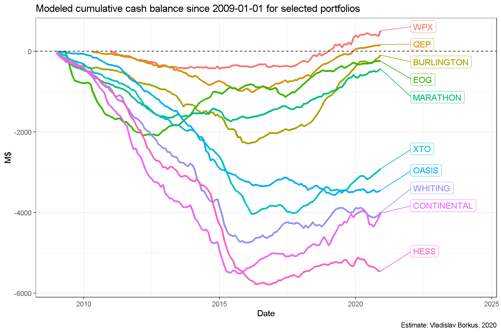

# 1. Много неудачных инвестиций
Отраслью было сделано крайне много неудачных инвестиций. Причем ошибки
были совершены и в части ожидаемых дебитов и в части ожиданий цены
нефти.

{width="800"}

# 2. Оптимизация инвестиций в последние пять лет
В ответ на кризис нефтяных цен 2014-2015 года компании сократили
инвестиционную активность.

{width="800"}

# 3. Выход на положительный кэш-флоу
Начиная с 2016 года доходы портфелей проектов в Bakken как правило превышают все расходы, включая
инвестиционные.

{width="800"}

# 4. Акцент на дебит в первый год, а не на долгую работу скважины
Новые проекты выбираются и делаются так, чтобы принести максимальный
дебит в первый год работы.

{width="800"}

# 5. Сокращение долга
Благодаря более осторожной инвестиционной политике, уровень долга
портфелей проектов удалось снизить, а части компаний даже достичь
некоторой долгосрочной доходности. Моделирование прекращения инвестиций "5 лет назад" в месторождение показывает, что компании смогли бы еще сильнее снизить размер долга,если бы поступили таким образом, но не смогли бы, вероятно, погасить долг полностью. 

{width="800"}

{width="800"}

# 6. Обводнение месторождения и смещение в сторону добычи газа
Вместе с тем долгосрочные перспективы месторождения не очень хорошие -
растет как обводненность, в том числе по новым скважинам, так и
происходит смещение в сторону менее прибыльной добычи газа.

{width="800"}

{width="800"}
